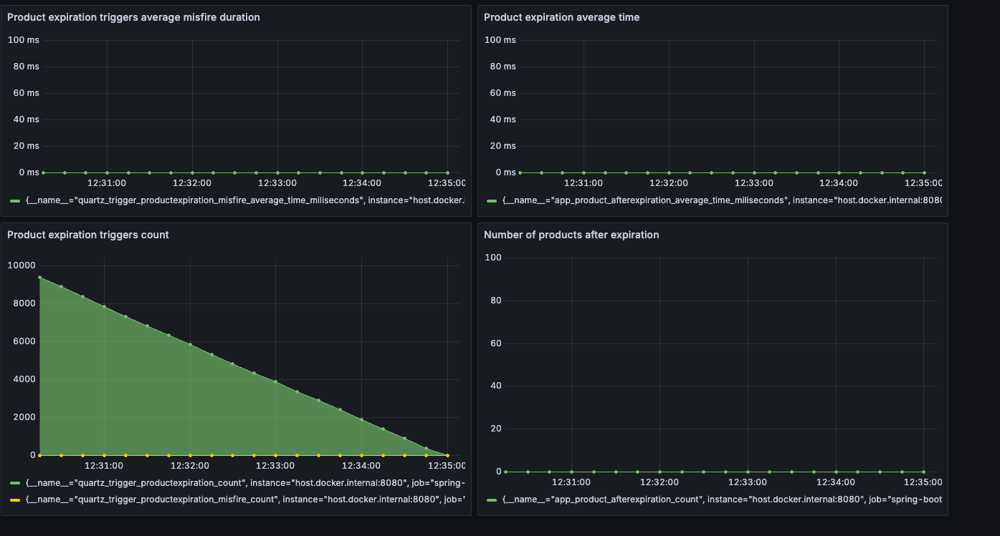
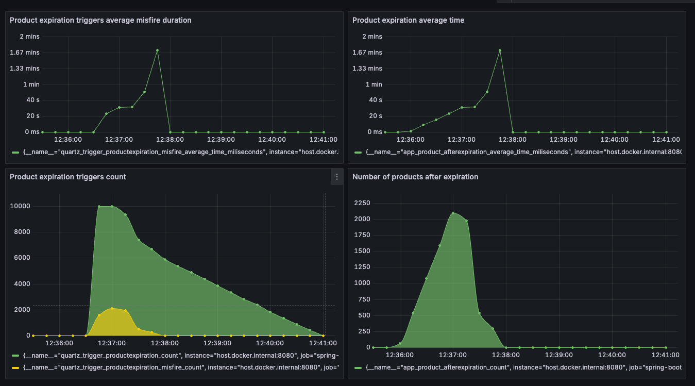
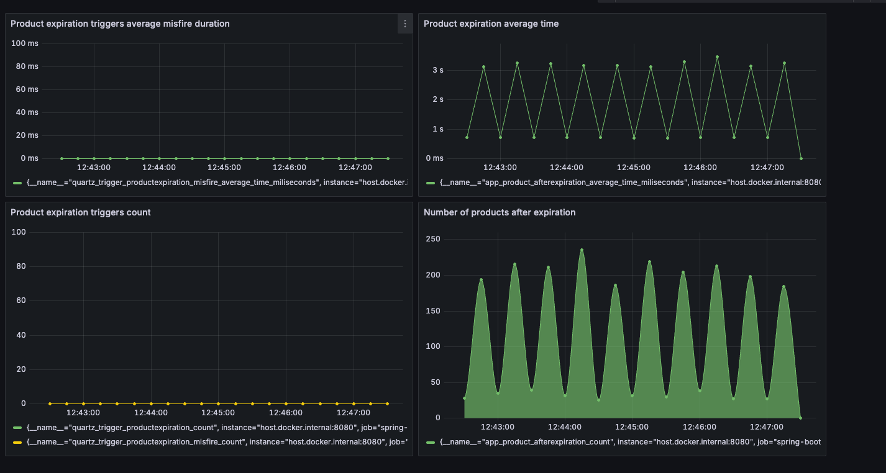

Pocet produktov pre expiraciu 10000
Cas za ktory produkty expiruju 300 sekund

# Triggers with in the memory store
Test prebehol bez akehokolvek zavahania, ziadne expiracie neboli vykonane oneskorene.

# Triggers with in the jdbc store
Test prebehol vporiadku, na zaciatku je vidno oneskorenie pri expiraciach kvoli tomu,
ze vytahujeme expiracie ktore sa maju vykonat takmer ihned a nestihame ich naplanovat kedze ulozenie triggerov trvalo takmer jednu minutu.

# Scheduled job 1m
Test prebehol vporiadku, mozme pozorovnat pravidelne oneskorenie pri expiracii,
co je dane povahou vykonavania expiracie, ktore sa vykonavaju pravidelne kazdu minutu, pre uz expirovane produkty.
Ak by sa vykonaval job castejsie, znizila by sa doba oneskorenia

